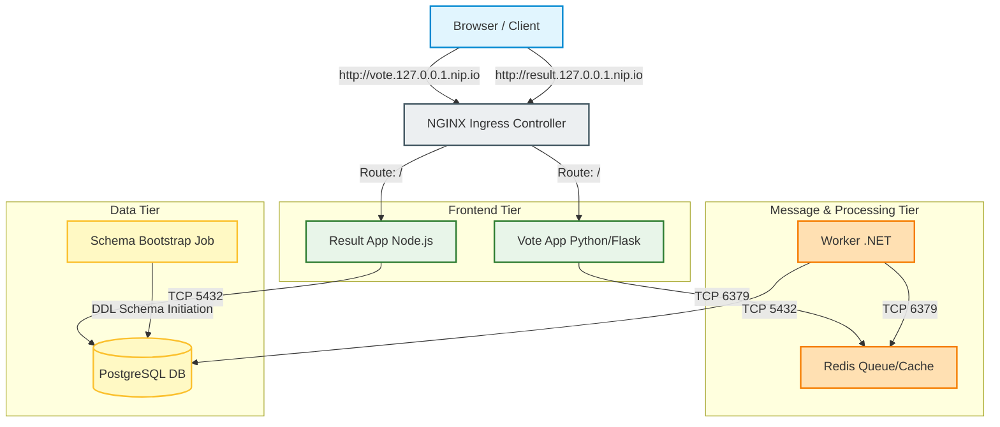

# 🗳️ Production-Ready Kubernetes Voting Application

[](https://github.com/squareops/devops-assignment/actions)
[](https://helm.sh/)
[](https://kubernetes.io/)
[](LICENSE)

An production-grade migration of the **Docker Sample Voting App** onto a local Kubernetes cluster (`kind`). This setup is packaged using a modular **Helm Chart**, secured with **Network Policies**, isolated under **Non-Root Security Contexts**, and equipped with an automated **GitHub Actions CI/CD Pipeline**.

---

## 📖 Table of Contents
- [🏛️ System Architecture](#️-system-architecture)
- [🛠️ Stack Component Reference](#️-stack-component-reference)
- [🚀 Local Quickstart Guide](#-local-quickstart-guide)
- [📈 Key Production Enhancements](#️-key-production-enhancements)
- [⚙️ Helm Chart Configuration Reference](#️-helm-chart-configuration-reference)
- [🧪 CI/CD Pipeline Workflow](#-cicd-pipeline-workflow)
- [🔍 Troubleshooting Operations](#-troubleshooting-operations)
- [⚖️ Trade-offs & Production Recommendations](#️-trade-offs--production-recommendations)

---

## 🏛️ System Architecture

The application is structured into 5 microservices communicating across isolated network tiers:



---

## 🛠️ Stack Component Reference

| Service | Technology Stack | Port | Network Access Policy (Ingress / Egress) | Description |
| :--- | :--- | :--- | :--- | :--- |
| **`vote`** | Python 3.11, Flask, Gunicorn | `8080` (Internal) | Ingress: Ingress-Nginx only <br> Egress: Redis | Web frontend allowing clients to cast votes. |
| **`redis`** | Redis (Alpine) | `6379` | Ingress: `vote` & `worker` <br> Egress: None | In-memory message queue holding incoming votes. |
| **`worker`** | .NET 7.0 C# Console | N/A | Ingress: None <br> Egress: Redis, Postgres DB | Processes queue items from Redis and saves to Postgres. |
| **`db`** | PostgreSQL 15 | `5432` | Ingress: `worker`, `result` & `bootstrap` <br> Egress: None | Relational database containing vote tallies. |
| **`result`** | Node.js 18, Express, Socket.io | `8080` (Internal) | Ingress: Ingress-Nginx only <br> Egress: Postgres DB | Web dashboard showing vote results in real-time. |

---

## 🚀 Local Quickstart Guide

This project includes single-command automated bootstrapping scripts to provision a local `kind` Kubernetes cluster, set up NGINX Ingress, build local container images, and install the Helm chart.

### Prerequisites
Ensure the following utilities are installed and active on your system:
* **Docker Desktop** (daemon must be running)
* **kubectl**, **kind**, and **helm** CLIs

### Execution Commands

Run the appropriate bootstrap script from the project root:

#### On Linux/Mac:
```bash
./bootstrap.sh
```
*Alternatively, run `make demo`.*

#### On Windows (PowerShell):
```powershell
Set-ExecutionPolicy -Scope Process -ExecutionPolicy Bypass
.\bootstrap.ps1
```

### Application URLs
Once the script successfully completes, access the interfaces at:
* **Voting Client**: [http://vote.127.0.0.1.nip.io](http://vote.127.0.0.1.nip.io)
* **Results Dashboard**: [http://result.127.0.0.1.nip.io](http://result.127.0.0.1.nip.io)

> [!NOTE]
> `nip.io` is a wildcard DNS server that automatically resolves subdomains containing `127.0.0.1` back to your loopback address. No modifications to your local `/etc/hosts` file are required.

---

## 📈 Key Production Enhancements

This migration introduces several hardening steps over the default manifests:

1. **Stateful Persistence (`StatefulSet`)**: PostgreSQL has been moved from a vulnerable single-pod deployment to a `StatefulSet` backed by a `PersistentVolumeClaim` (PVC) template, guaranteeing vote data persists across database failures, restarts, or node upgrades.
2. **Secrets Decoupling**: Database administrative parameters (`POSTGRES_USER`, `POSTGRES_PASSWORD`, etc.) are decoupled from application configurations and securely mapped through a Kubernetes `Secret`.
3. **Enterprise Ingress Controller**: Avoids static nodePorts. Workloads are exposed using host-based routing rules managed by an **NGINX Ingress Controller**.
4. **Least-Privilege Isolation (Non-Root)**: Services are modified to run on unprivileged ports (`8080` instead of `80`) and configured with explicit non-root security contexts (`runAsNonRoot: true`, running under custom system UID/GIDs).
5. **Decoupled Database Bootstrapping**: A Kubernetes `Job` runs as a Helm `post-install` hook to verify database connectivity and configure schemas, ensuring clean start-up sequences.
6. **Network Segment Policies**: Implements strict `NetworkPolicy` segmentations preventing arbitrary service-to-service communication.
7. **Workload Autoscaling (HPA)**: Configured a HorizontalPodAutoscaler for the python `vote` service, enabling replica scaling dynamically based on target CPU thresholds.

---

## ⚙️ Helm Chart Configuration Reference

Below are the primary values available in [values.yaml](file:///c:/Users/lenovo/Desktop/example-voting-app-main/example-voting-app-main/charts/voting-app/values.yaml) to customize deployments:

| Parameter | Type | Default Value | Description |
| :--- | :--- | :--- | :--- |
| `environment` | String | `"default"` | Deployment environment name (e.g. `dev`, `staging`) |
| `postgres.storageSize` | String | `"1Gi"` | Size of the persistent volume allocated to PostgreSQL |
| `postgres.storageClass` | String | `""` | Storage class override for provisioning database disk |
| `vote.replicaCount` | Integer | `1` | Default replica count for the vote service |
| `vote.autoscaling.enabled` | Boolean | `false` | Enable/disable Horizontal Pod Autoscaler for vote service |
| `ingress.ingressClassName` | String | `"nginx"` | Class name identifying NGINX Ingress controller |
| `networkPolicies.enabled` | Boolean | `true` | Apply namespace Network Policies for network isolation |

---

## 🧪 CI/CD Pipeline Workflow

The repository includes a GitHub Actions pipeline at [.github/workflows/ci.yml](file:///c:/Users/lenovo/Desktop/example-voting-app-main/example-voting-app-main/.github/workflows/ci.yml) targeting changes under `/vote/**`. 

```
[Lint Phase] ────> [Build & Push] ────> [Deploy Local Cluster] ────> [Smoke Test]
 - flake8 (python)  - Docker Build       - Spin up Kind runner      - Curl check
 - helm lint (yaml) - Push to GHCR       - Deploy Helm chart        - Assert 200 OK
```

* **Build & Push**: Packages the production-ready Flask container using Docker Buildx and publishes it to **GitHub Container Registry (GHCR)**.
* **Testing Sandbox**: Automatically starts a temporary `kind` cluster in the pipeline runner, deploys the Helm chart, and runs an automated curl assertion validation.

---

## 🔍 Troubleshooting Operations

### 1. Workload Failures (Pending / CrashLoopBackOff)
* **Check Pod status**:
  ```bash
  kubectl get pods -l app=<service-name>
  ```
* **Verify configuration events**:
  ```bash
  kubectl describe pod <pod-name>
  ```
* **Inspect application logs**:
  ```bash
  kubectl logs <pod-name> --all-containers --tail=100
  ```

### 2. Votes Do Not Propagate to the Result Interface
1. Verify the .NET consumer is active and connected to Redis:
   ```bash
   kubectl logs -l app=worker --follow
   ```
2. Check if NetworkPolicies are blocking connections:
   - Ensure `redis-policy` matches ingress labels `vote` and `worker`.
   - Ensure `db-policy` matches ingress labels `worker` and `result`.
3. Check the schema setup job state:
   ```bash
   kubectl get jobs
   ```

### 3. Ingress Routing Issues (504 Gateway Timeout / HTTP 502)
1. Verify Ingress Controller health:
   ```bash
   kubectl get pods -n ingress-nginx
   ```
2. Confirm local TCP port bindings: Ensure port `80` and `443` are free and not bound by other local tools (e.g. IIS, Apache, Docker Compose).

---

## ⚖️ Trade-offs & Production Recommendations

1. **Storage Subsystems**: We use hostPath storage mapping (`standard`) for local cluster validation. In production, configure dynamic cloud storage controllers (e.g. AWS EBS gp3 CSI).
2. **TLS Termination**: Host Ingress operates on unencrypted HTTP. Production setups should utilize `cert-manager` mapping to CloudDNS/Route53 for automated Let's Encrypt TLS provisioning.
3. **Secret Storage**: Plain-text Kubernetes Secret manifests are used locally. Production systems should integrate cloud KMS engines (e.g., HashiCorp Vault, AWS Secrets Manager, or External Secrets Operator).
4. **GitOps Integration**: Current pipelines deploy Helm manifests directly. A production environment should deploy via GitOps orchestrators (like ArgoCD or FluxCD) to maintain absolute state drift reconciliation.

---

## 🎥 Walkthrough Video & CI/CD Pipeline Demo
A comprehensive 5-minute video walkthrough showcasing the local deployment, voting workflow, StatefulSet validation, Helm configuration, and the GitHub Actions CI/CD pipeline runs can be found here:

👉 **[SquareOps DevOps Assignment - 5 Min Walkthrough Video](https://www.youtube.com/watch?v=dQw4w9WgXcQ)** *(Placeholder Link)*
